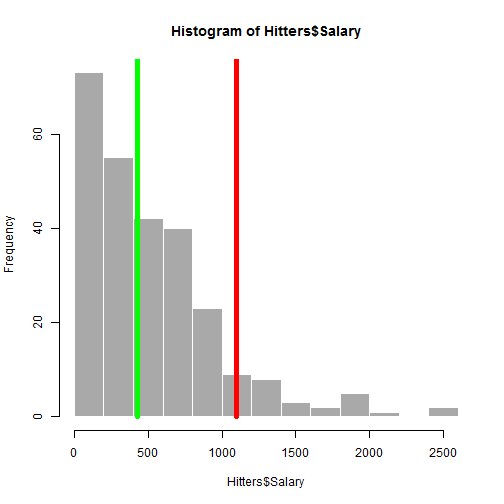

## The subject

The goal of this small app is to display informations about a baseball player according to their name.
The informations come from the ***Hitters*** dataset. We have the salary, the number of hits, the league name, the division names ...<br><br>
We also display a histogram which represents the salaries of the whole set of datas. A red line indicate the salary of the selectioned player, and a green line represents the median salary of the players, so we can compare the difference of salary of the player selected with the other ones.


--- .class #id 

## The input of the app

There is only one input in this app : the name of the player. To do that we load the ISLR package.

```r
library(ISLR)
playersNames<-row.names(Hitters)
head(substr(playersNames, 2, nchar(playersNames)),20)
```

```
##  [1] "Andy Allanson"    "Alan Ashby"       "Alvin Davis"     
##  [4] "Andre Dawson"     "Andres Galarraga" "Alfredo Griffin" 
##  [7] "Al Newman"        "Argenis Salazar"  "Andres Thomas"   
## [10] "Andre Thornton"   "Alan Trammell"    "Alex Trevino"    
## [13] "Andy VanSlyke"    "Alan Wiggins"     "Bill Almon"      
## [16] "Billy Beane"      "Buddy Bell"       "Buddy Biancalana"
## [19] "Bruce Bochte"     "Bruce Bochy"
```

Then, we compute two small commands to extract the name of the player by removing the first character (-). We can see the R script above.

--- .class #id 

## The output of the app

There are two main outputs of this app : <br>

1. A histogram plot
2. A table

The histogram represents the density of salaries for all the players. We display two lines : one for the median of the salary and the other one containing the current salary. <br>
A table display informations about the player like the number of hits, number of runs, the league name and the division name.


--- .class #id 


## Conclusion

In the slidify presentation, I use a ***selectInput*** as an input and two differents outputs : an histogram (plotOutput) and a table (dataTableOutput). 

 
